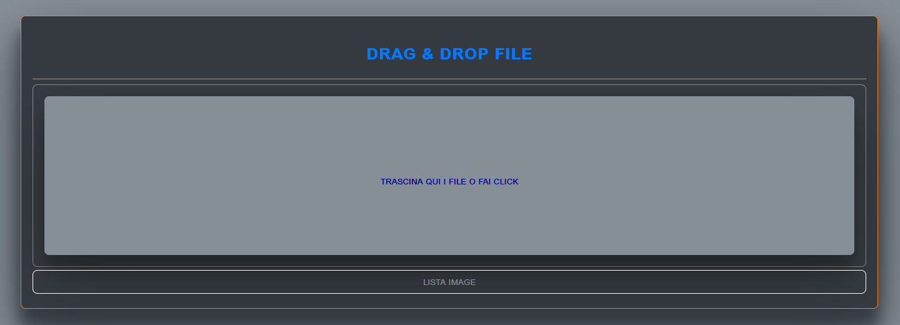
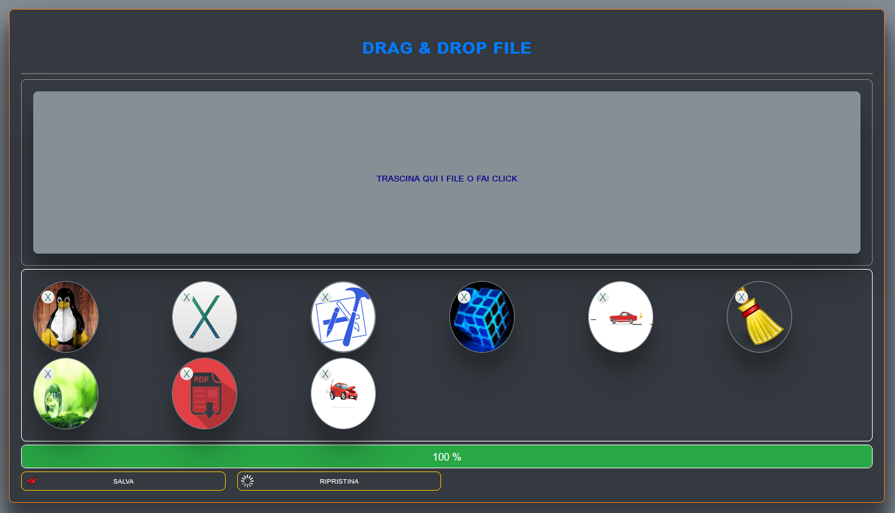

# INIZIO

<h1>DRAG & DROP FILE</h1>

<a href="https://ivanpierdeveloper.github.io/drag-e-drop-file/">VAI ALL'APP</a>

Purtroppo su github non funziona perfettamente, bisogna scaricare il codice sorgente e,

lanciare l'App dal proprio computer.

Buon lavoro.

# FINE
